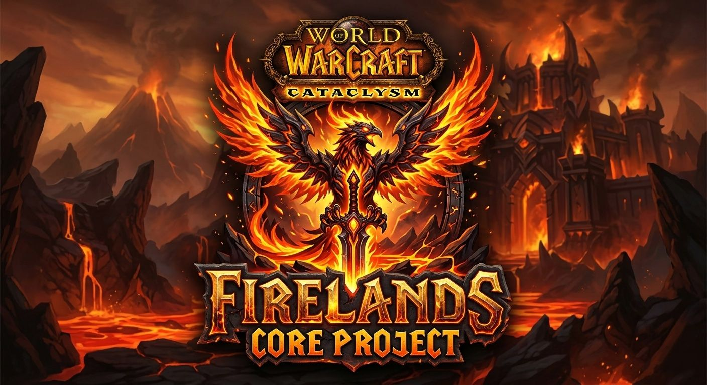

# 🔥 Firelands Wiki



> The official repository for the Firelands Core Project documentation.

Welcome, Chronicler. This sanctuary holds all the knowledge required to build, maintain, and expand the Firelands Core. Built with **Astro**, this wiki is designed for speed, clarity, and ease of contribution.

---

## ✨ Features

- **🚀 Legendary Speed**: 100/100 Lighthouse performance.
- **🔍 SEO Optimized**: Canonical URLs, OpenGraph meta tags, and structured data.
- **📜 Semantic Markdown**: Full support for Markdown & MDX with custom callouts.
- **📻 RSS & Sitemaps**: Automatic feed generation for the latest updates.
- **📱 Responsive Design**: Optimized for scrolls of all sizes (mobile, tablet, desktop).

---

## 🗺️ Project Cartography

Explore the structure of the repository:

```text
├── public/          # 🖼️ Static relics (images, icons)
├── src/
│   ├── components/  # 🧩 Modular fragments of the UI
│   ├── content/     # 📚 The Great Library (Markdown/MDX documents)
│   ├── layouts/     # 🏛️ Architectural blueprints for pages
│   └── pages/       # 🌐 Navigable realms and routes
├── astro.config.mjs # ⚙️ The Core's configuration
└── package.json    # 📦 Required materials and spells
```

### 📚 Contributing to the Library
The `src/content/` directory contains "collections" of related documents.
- Use `getCollection()` to retrieve documents from `src/content/docs/`.
- Type-check your frontmatter using the schemas defined in `src/content/config.ts`.

---

## 🧞 Command Spells

Run these commands from the root of the project to manipulate the wiki:

| Ritual | Effect |
| :--- | :--- |
| `pnpm install` | Gather the required dependencies. |
| `pnpm run dev` | Summon the local preview at `localhost:4321`. |
| `pnpm run build` | Forge the production-ready scrolls. |
| `pnpm run preview` | Inspect the forged scrolls before deployment. |
| `pnpm run astro ...` | Invoke specific CLI incantations. |

---

## 👀 Additional Wisdom

- 📖 [Astro Documentation](https://docs.astro.build)
- 💬 [Firelands Discord](https://discord.gg/firelandsproject)
- 🏗️ [Firelands Core Repository](https://github.com/FirelandsProject)

---

## 🎨 Credit
This theme is inspired by the elegant [Bear Blog](https://github.com/HermanMartinus/bearblog/). Refined for the Firelands Project adventuring party.
