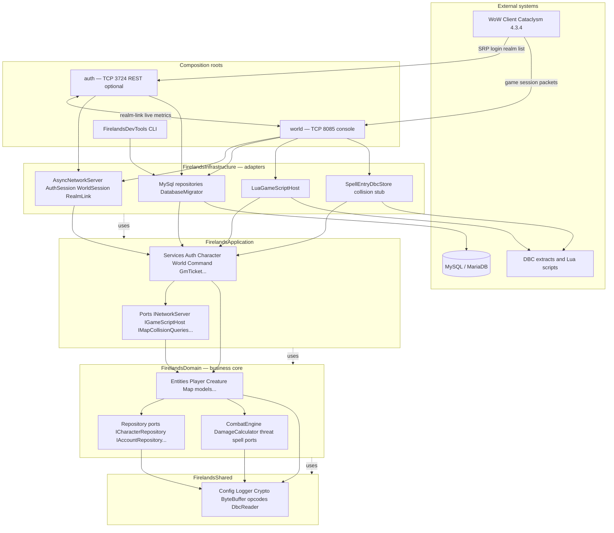

# Hexagonal Architecture

**firelands-next** implements **Hexagonal Architecture** (Ports & Adapters). Business rules live at the center; databases, sockets, Lua, and DBC files plug in through interfaces. The client target is **WoW Cataclysm 4.3.4 (build 15595)**.

## Core Definitions

| Term | Meaning in Firelands |
|------|---------------------|
| **Port** | Abstract interface the core depends on (e.g. `ICharacterRepository`, `IGameScriptHost`). Domain and application layers define ports; infrastructure implements them. |
| **Adapter** | Concrete implementation of a port (e.g. `MySqlCharacterRepository`, `LuaGameScriptHost`). Lives in `infrastructure/`. |
| **Entity** | Mutable object with identity and lifecycle (e.g. `Player`, `Creature`, `Character`). |
| **Value Object** | Immutable data without identity (e.g. coordinates, spell cooldown snapshots, GUID wrappers). |
| **Use Case / Service** | Application-layer orchestration (e.g. `CharacterService`, `CommandService`) that coordinates domain objects through ports. |
| **Composition Root** | Executable entry point (`auth`, `world`) that wires concrete adapters to ports at startup. |
| **Repository** | Port for persistence; domain declares `I*Repository`, infrastructure provides `MySql*`. |

## Layer Structure
```
src/
├── shared/           # FirelandsShared — config, logging, crypto, DBC, wire formats
├── domain/           # FirelandsDomain — entities, world model, combat, repository ports
├── application/      # FirelandsApplication — use cases, services, application ports
├── infrastructure/   # FirelandsInfrastructure — MySQL, ASIO, Lua, DBC stores, REST
├── auth/             # Auth server composition root
├── world/            # World server composition root
└── tools/            # FirelandsDevTools CLI
```

**CMake link order:** `FirelandsShared` → `FirelandsDomain` → `FirelandsApplication` → `FirelandsInfrastructure` → executables.

## Dependency Rule

- `domain/` must **not** import from `application/` or `infrastructure/`.
- `application/` depends on `domain/` + `shared/` only — no concrete MySQL or Boost.Asio headers.
- External dependencies flow inward: **Infrastructure → Application → Domain → Shared**.
- Communication across boundaries uses abstract ports, injected at startup in `auth/main.cpp` and `world/main.cpp`.

## Shared Layer (`FirelandsShared`)

Lowest library; no game services or persistence. Add code here only when multiple layers need it and it has no MariaDB/ASIO dependency.

| Area | Path | Purpose |
|------|------|---------|
| Config | `shared/Config.{h,cpp}` | YAML loading (`authserver.yaml`, `worldserver.yaml`); env overrides `FIRELANDS_AUTH_CONFIG` / `FIRELANDS_WORLD_CONFIG` |
| Logging | `shared/Logger.h` | spdlog wrapper; always include via this header for `SPDLOG_LEVEL_NAMES` |
| Crypto / SRP | `shared/Crypto.h`, `SRPConstants.h`, `BigInt.h` | SRP-6a math for authentication |
| Networking | `shared/network/` | `ByteBuffer`, `WorldPacket`, opcodes (`WorldOpcodes.h`), wire codecs (`SpellCastWire`, gossip packets), `WorldCrypt.h` |
| DBC | `shared/dbc/DbcReader.cpp` | Client `.dbc`-style binary table reader |
| Game helpers | `shared/game/` | Access levels, permissions, GM appearance, experience tables |
| TUI | `shared/tui/` | FTXUI helpers for interactive consoles |

## Domain Layer (`FirelandsDomain`)

Models **what** the emulator manipulates — not **how** data is stored or packets are sent.

### World entities (`domain/world/`)

| Type | File | Role |
|------|------|------|
| `WorldObject` | `WorldObject.h` | Base: GUID, `MovementInfo` position |
| `Player` | `Player.{h,cpp}` | Live health/power, auras, map notifications |
| `Creature` | `Creature.{h,cpp}` | NPC entry, faction, flags, combat XP |
| `GameObject` | `GameObject.{h,cpp}` | World object placement |
| `Map` | `Map.{h,cpp}` | Object grid / spatial indexing |
| `Aura` | `Aura.h`, `UnitAuraState.*` | Buff/debuff state on units |

### Account / data models (`domain/models/`)

`Character`, `Realm`, `PlayerCreateInfo`, `GmTicket`, `GossipMenu`, `NpcText`, `QuestGossip`, `SpellDefinition`, `WebSession`, `Chat`, and `Account` (via `IAccountRepository.h`).

### Combat domain (`domain/combat/`)

| Component | Role |
|-----------|------|
| `CombatEngine` | Core combat resolution |
| `DamageCalculator` | Damage formulas |
| `ICombatEntity` | Combat-capable entity contract |
| `IThreatManager` | Threat table port |
| `ISpellProcessor` | Spell processing port |

### Repository ports (`domain/repositories/`)

| Port | Purpose |
|------|---------|
| `IAccountRepository` | Accounts, SRP verifiers, session keys |
| `IRealmRepository` | Realm list rows |
| `ICharacterRepository` | Character CRUD and online state |
| `IPlayerCreateInfoRepository` | Starter positions, spells, skills |
| `IWebSessionRepository` | REST session tracking |
| `IGmTicketRepository` | GM help tickets |
| `IGossipRepository` | Gossip menu data |
| `INpcTextRepository` | NPC dialog text |
| `IQuestGossipRepository` | Quest gossip lines |
| `ICreatureSpawnRepository` | Creature spawn rows |
| `ICreatureClassLevelStatsRepository` | NPC level stats |
| `INpcTemplateSearchRepository` | `.npc search` template lookup |
| `ISpellDefinitionStore` | Spell metadata |
| `ISpellCastTables` | Cast-time / power cost tables |

## Application Layer (`FirelandsApplication`)

Use cases and orchestration without knowing MariaDB or socket details.

### Services (`application/services/`)

| Service | Role |
|---------|------|
| `AuthService` | Account lookup, SRP verification, session keys |
| `SRPService` | SRP-6a verification helpers |
| `CharacterService` | Character list and persistence |
| `PlayerCreateInfoService` | Character creation templates |
| `RealmListService` | Realm list + live population via `IRealmLiveState` |
| `WorldService` | Runtime world façade: maps, players, creatures, Lua host, collision port |
| `CommandService` | Staff `.` commands and console dispatch |
| `GmTicketService` | Ticket queue, assignment, replies |
| `OnlineCharacterSessionRegistry` | Online name → session for console targeting |
| `WebSessionService` | REST login/session flows |

### Spell & combat (`application/spell/`, `application/combat/`)

`SpellManager` and spell effect modules; `CombatService`, hostility, chase logic.

### Application ports (`application/ports/`)

| Port | Implemented by |
|------|----------------|
| `INetworkServer` | `AsyncNetworkServer` |
| `IAuthSession` | `AuthSession` |
| `ICommandService` / `ICommandSession` | `CommandService` / `WorldSession` |
| `IGameScriptHost` | `LuaGameScriptHost` |
| `IMapCollisionQueries` | `MapCollisionQueriesStub` (vmap planned) |
| `IMapNotifier` | Map/player update notifications |
| `IRealmLiveState` | `RealmLiveRegistry` + realm-link |

## Infrastructure Layer (`FirelandsInfrastructure`)

Wires the emulator to the outside world. All socket I/O uses **C++20 coroutines** (`co_await`, `boost::asio::use_awaitable`).

### Persistence (`infrastructure/persistence/`)

| Adapter | Port |
|---------|------|
| `DatabaseMigrator` | Runs `sql/bundled/` → `sql/init/` → `sql/migrations/`; tracks `schema_migrations` |
| `MySqlAccountRepository` | `IAccountRepository` |
| `MySqlRealmRepository` | `IRealmRepository` |
| `MySqlCharacterRepository` | `ICharacterRepository` |
| `MySqlPlayerCreateInfoRepository` | `IPlayerCreateInfoRepository` |
| `MySqlGmTicketRepository` | `IGmTicketRepository` |
| `MySqlGossipRepository`, `MySqlNpcTextRepository`, `MySqlQuestGossipRepository` | Gossip ports |
| `MySqlCreatureSpawnRepository`, `MySqlCreatureClassLevelStatsRepository` | Spawn/stats |
| `MemoryWebSessionRepository` | `IWebSessionRepository` (in-memory) |
| `InMemoryThreatManager`, `MySqlThreatManager`, `MySqlSpellProcessor` | Combat ports |

### Network (`infrastructure/network/`)

| Component | Role |
|-----------|------|
| `AsyncNetworkServer` | Coroutine accept loop; `Update()` polls `io_context` |
| `AuthSession` | Auth client read/write loops |
| `WorldSession` | World client; split handlers under `worldsession/*.cpp` |
| `RestAuthServer` | REST login on `Network.RestPort` |
| `RealmLinkSession` / `RealmLinkOutbound` | Auth ↔ world live realm metrics |

### Other adapters

| Component | Role |
|-----------|------|
| `LuaGameScriptHost` | Lua 5.4 scripting under `Scripting.ScriptsDirectory` |
| `SpellEntryDbcStore`, `SpellCastTablesDbc` | Client DBC spell data |
| `MapCollisionQueriesStub` | Placeholder until full vmap integration |

## Executables (Composition Roots)

| Target | Binary | Startup summary |
|--------|--------|-----------------|
| `auth` | `build/bin/auth` | Load `authserver.yaml` → migrate DB → wire MySQL repos → start auth TCP (3724), optional realm-link + REST (8081) |
| `world` | `build/bin/world` | Load `worldserver.yaml` → init Lua + fire `world_startup` → migrate DB → connect auth/characters/world DBs → start world TCP (8085) + interactive console |
| `FirelandsDevTools` | `build/bin/FirelandsDevTools` | CLI for accounts and realm management |

**Operational flow:** clients authenticate on **auth** (SRP-6a, realm list), then connect to **world** with session-derived crypto. **Realm-link** syncs live population/load from world to auth when configured.

## Wire Format

Packet layouts and opcodes target **WoW Cataclysm 4.3.4 (build 15595)**. Shared builders live under `src/shared/network/` (e.g. `SpellCooldownWire`, `KnownSpellsWire`, gossip packets). `ByteBuffer` uses C++20 `std::span` helpers for safe reads and writes. `WorldSession` handlers are split by concern: movement, spells, gossip, GM state, tickets, object updates.

## Precompiled Headers (PCH)

Heavy headers precompiled for faster builds: STL containers, spdlog, nlohmann/json, `shared/Common.h`, `shared/Logger.h`. When adding targets:

```cmake
target_precompile_headers(<target_name> PRIVATE ${PROJECT_PCH_HEADERS})
```

**Important:** spdlog MUST be included via `<shared/Logger.h>`. `LuaGameScriptHost.cpp` skips PCH for toolchain compatibility.

## C++ Conventions

| Rule | Detail |
|------|--------|
| Standard | C++20 (`std::filesystem`, `std::optional`, `std::variant`, `std::span`, coroutines in network code) |
| Naming | `snake_case` functions/variables; `PascalCase` types; `UPPER_SNAKE_CASE` constants; **kebab-case** file names |
| Language | English only for code, comments, and commits |
| WoW terms | Use Blizzard nomenclature: `Aura`, `Unit`, `SpellEffect`, etc. |
| Logging | Always via `<shared/Logger.h>` |
| Threading | `std::thread` in business code |
| Commits | `type(scope): description` — types: `feat`, `fix`, `refactor`, `docs`, `test`, `chore`, `perf` |
| TDD | Red → Green → Refactor for all new behavior |

## Architectural Diagram

Overview of **composition roots**, hexagonal **layers**, and **external systems**. Arrows show runtime wiring; dotted lines show the **dependency rule** (each layer depends only on layers below it — domain never imports infrastructure).



**CMake link order (libraries):** `FirelandsShared` → `FirelandsDomain` → `FirelandsApplication` → `FirelandsInfrastructure` → `auth` / `world` / `FirelandsDevTools`.
