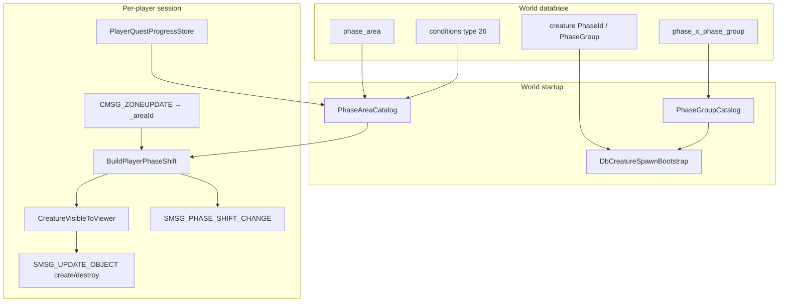

# Phase System

Cataclysm **phasing** lets different players see different world states in the same map coordinates: quest hubs that change after story progress, Gilneas starting zones, script triggers that only some players interact with, and NPCs that appear or disappear based on phase IDs.

Firelands implements the Cataclysm **PhaseId** model (not the older pre-Cata `phaseMask` bitmask on spawns). Visibility is computed server-side from `PhaseShift` values on the player and each creature, then synchronized to the client with `SMSG_PHASE_SHIFT_CHANGE` and filtered `SMSG_UPDATE_OBJECT` traffic.

## At a glance

| Concern | Where it lives |
|---------|----------------|
| Visibility math | `src/shared/game/PhaseShift.{h,cpp}` |
| Player phase assembly | `src/application/world/PlayerPhaseShift.{h,cpp}` |
| Area + quest gates | `PhaseAreaCatalog`, `PhaseConditionEvaluator` |
| Phase groups | `PhaseGroupCatalog` |
| World DB load | `MySqlPhase*Repository`, migrations `53`–`57`, `59` |
| Character quest state | `character_queststatus*` (migration `58`) |
| Session orchestration | `WorldSessionPhasing.cpp`, `WorldSessionAreaPhasing.cpp` |
| Client packet | `PhaseShiftWire` → `SMSG_PHASE_SHIFT_CHANGE` |
| Spawn bootstrap | `DbCreatureSpawnBootstrap` + `InitDbCreaturePhaseShift` |



## Core concept: `PhaseShift`

Every player and creature carries a `PhaseShift` (`src/shared/game/PhaseShift.h`):

| Field | Role |
|-------|------|
| `flags` | Bitmask (`PhaseShiftFlags`): `Unphased`, `Inverse`, `AlwaysVisible`, `InverseUnphased`, … |
| `phases` | List of `{ id, phaseFlags }` phase IDs (uint16) |
| `personalGuid` | Reserved for personal-phase objects (not heavily used yet) |

**Default phase ID** `169` (`kDefaultPhaseId`) is the Cataclysm “normal world” phase. Spawns with no explicit phase or only the default phase are treated as **unphased** and visible to unphased players.

Visibility uses `PhaseShift::CanSee(other)` with these rules:

1. Both **unphased** → visible.
2. Either side has **AlwaysVisible** → visible.
3. Both **inverse** → visible.
4. Otherwise, if neither is inverse: visible when **any phase ID intersects**.
5. If one side is **inverse**: visible when the viewer’s phases do **not** overlap the subject’s (inverse phasing).

Unit tests in `tests/unit/shared/PhaseShiftTests.cpp` lock in the main cases (unphased vs phased, matching IDs, always-visible spawns).

## Database layer

### World tables (`firelands_world`)

#### `phase_area`

Maps an **AreaTable** area ID to a phase ID applied to players while they are in that area (after conditions pass).

| Column | Description |
|--------|-------------|
| `AreaId` | `AreaTable.dbc` area (part of PK) |
| `PhaseId` | Phase to apply (part of PK) |
| `Comment` | Human note |

One area can have **multiple** rows (different phases for different quest states). Example from seed data: area `5140` (Highbank) has phase `169` after quest `28598` is rewarded and phase `361` before.

DDL: migration `54_world_phase_area.sql`. Data: migration `55_world_phase_catalog_data.sql`.

#### `phase_x_phase_group`

Expands a **PhaseGroup** ID into many phase IDs (mirrors client `PhaseXPhaseGroup.dbc`).

| Column | Description |
|--------|-------------|
| `ID` | Row id (PK) |
| `PhaseID` | Member phase |
| `PhaseGroupID` | Group id (indexed) |

Used when `creature.PhaseId = 0` and `creature.PhaseGroup != 0`. DDL: `53_world_phase_x_phase_group.sql`. Data: migration `55`.

#### `conditions` (source type 26)

Quest, aura, and negated gates for a specific `(PhaseId, AreaId)` pair from `phase_area`.

| Column | Role for phasing |
|--------|------------------|
| `SourceTypeOrReferenceId` | `26` = `CONDITION_SOURCE_TYPE_PHASE` |
| `SourceGroup` | Phase ID |
| `SourceEntry` | Area ID |
| `ElseGroup` | OR-group id (any passing group activates the phase) |
| `ConditionTypeOrReference` | See supported types below |
| `ConditionValue1` | Quest id, spell id, etc. |
| `NegativeCondition` | Invert result |

Supported condition types (mapped in `MySqlPhaseConditionRepository`):

| DB condition type | `PhaseConditionType` | Meaning |
|---------|----------------------|---------|
| `1` | `Aura` | Player has aura spell `Value1` |
| `8` | `QuestRewarded` | Quest `Value1` turned in |
| `9` | `QuestTaken` | Quest `Value1` active (`Incomplete`) |
| `28` | `QuestComplete` | Quest `Value1` complete but not rewarded |

DDL: `56_world_conditions.sql`. Phase rows: `57_world_phase_conditions_data.sql`.

#### `creature` spawn columns

| Column | Description |
|--------|-------------|
| `phaseUseFlags` | `0x1` = always visible + unphased; `0x2` = inverse spawn |
| `PhaseId` | Single phase when non-zero |
| `PhaseGroup` | Resolved via `phase_x_phase_group` when `PhaseId` is 0 |

At load time, `InitDbCreaturePhaseShift` builds the creature’s `PhaseShift` from these columns (`src/shared/game/PhaseShift.cpp`).

**Trigger NPCs** (`CREATURE_FLAG_EXTRA_TRIGGER`): players normally see display id `11686` (invisible). GMs with tag on see the real model and can target units that use `UNIT_FIELD_FLAG_NOT_SELECTABLE` (`GmCreatureVisibility.h`).

Migration `59_world_creature_trigger_phase_fix.sql` corrects corrupted trigger rows (`PhaseId=169, PhaseGroup=0` → `PhaseId=1, PhaseGroup=169`).

### Character tables (`firelands_characters`)

Quest-gated phasing needs persisted progress:

| Table | Purpose |
|-------|---------|
| `character_queststatus` | Active quests (`status`) |
| `character_queststatus_rewarded` | Turned-in quests |

DDL: `58_characters_queststatus.sql`. Loaded on login via `MySqlPlayerQuestProgressRepository` into `PlayerQuestProgressStore`.

### Import tools

Regenerate world data with import scripts:

```bash
python3 tools/sql/import_ref_phase_data.py        # phase_area + phase_x_phase_group → migration 55
python3 tools/sql/import_ref_phase_conditions.py  # conditions type 26 → migration 57
```

After schema changes: `cmake --build build --target merge-migrations` and restart **world**.

## Layer-by-layer implementation

### Shared (`FirelandsShared`)

| Component | Path | Responsibility |
|-----------|------|----------------|
| `PhaseShift` | `shared/game/PhaseShift.{h,cpp}` | Visibility rules, `InitDbCreaturePhaseShift` |
| `PhaseShiftWire` | `shared/network/PhaseShiftWire.{h,cpp}` | `SMSG_PHASE_SHIFT_CHANGE` encoder |
| `SpellAuraTypes` | `shared/game/SpellAuraTypes.h` | `kSpellAuraPhase` (261), `kSpellAuraPhaseGroup` (326), `kSpellAuraPhaseAlwaysVisible` (327) |
| `GmCreatureVisibility` | `shared/game/GmCreatureVisibility.h` | GM bypass + trigger display wiring |
| `AreaTableDbc` | `shared/dbc/AreaTableDbc.{h,cpp}` | `ResolveAreaForPhasing` — map-safe area id for `phase_area` |

`ResolveAreaForPhasing` walks parent areas in `AreaTable.dbc` so a sub-area hint from the client still matches `phase_area` rows keyed on a parent zone.

### Domain (`FirelandsDomain`)

| Component | Responsibility |
|-----------|----------------|
| `PhaseCondition` | Value object for one condition row |
| `IPlayerQuestProgress` | Port: quest status, rewarded set, aura check |
| `IPlayerQuestProgressRepository` | Load snapshot for a character |
| `IPhaseAreaCatalogRepository` | Load `phase_area` map |
| `IPhaseConditionRepository` | Load type-26 conditions |
| `IPhaseGroupCatalogRepository` | Load phase group membership |
| `Player` / `Creature` | Store `PhaseShift` on the entity |

Repository interfaces live under `src/domain/repositories/`; models under `src/domain/models/PhaseCondition.h`.

### Application (`FirelandsApplication`)

| Component | Responsibility |
|-----------|----------------|
| `PhaseGroupCatalog` | In-memory `phase_x_phase_group` index |
| `PhaseAreaCatalog` | Resolve phases for an area + player; walk parent areas up to 32 levels |
| `PhaseAreaCatalogBuilder` | Merge `phase_area` with conditions at load time |
| `PhaseConditionEvaluator` | ElseGroup OR semantics (any passing group activates the phase) |
| `PlayerPhaseShift` | `BuildPlayerPhaseShift` — area phases + aura effects |
| `PlayerQuestProgressStore` | Session quest/aura cache implementing `IPlayerQuestProgress` |

**Player phase build order** (`BuildPlayerPhaseShift`):

1. Start with `Unphased` flag.
2. Add all area phases from `PhaseAreaCatalog::ResolveForArea`.
3. Scan active auras via `ISpellDefinitionStore`:
   - `SPELL_AURA_PHASE` → add phase id from `miscValue` / `miscValueB`
   - `SPELL_AURA_PHASE_GROUP` → expand group via `PhaseGroupCatalog`
   - `SPELL_AURA_PHASE_ALWAYS_VISIBLE` → set AlwaysVisible + Unphased
4. `FinalizePlayerUnphasedFlag`: if any non-default phase exists, clear `Unphased`; otherwise stay unphased (unless AlwaysVisible).

**Condition evaluation**: empty condition list → phase applies. Otherwise **any** `ElseGroup` where all conditions in that group pass → phase applies. See `PhaseConditionEvaluatorTests` (Highbank `28598` / phase `361` vs `169`).

### Infrastructure (`FirelandsInfrastructure`)

| Adapter | Loads |
|---------|--------|
| `MySqlPhaseAreaCatalogRepository` | `phase_area` |
| `MySqlPhaseConditionRepository` | `conditions` WHERE type = 26 |
| `MySqlPhaseGroupCatalogRepository` | `phase_x_phase_group` |
| `MySqlPlayerQuestProgressRepository` | `character_queststatus*` |

**World startup** (`WorldApplication.cpp`):

1. Load `PhaseGroupCatalog` and `PhaseAreaCatalog` (with merged conditions).
2. Register catalogs on `WorldService`.
3. `LoadDatabaseCreatureSpawns(..., phaseGroupCatalog, ...)` — each spawn gets `PhaseShift`.

**Per-session** (`WorldSessionPhasing.cpp`, `WorldSessionAreaPhasing.cpp`):

| Event | Behavior |
|-------|----------|
| Login | `LoadQuestProgressForCharacter`, `RebuildPlayerPhaseShiftFromActiveAuras`, `SendPlayerPhaseShiftToClient`, spawn only phase-visible nearby creatures |
| `CMSG_ZONEUPDATE` | `SetSessionAreaId` → if area changed, rebuild phase + refresh visibility |
| Phase aura apply/remove | `MaybeRefreshPlayerPhaseAfterAuraChange` in `WorldSessionSpellEffects.cpp` |
| Quest progress change | `RefreshPlayerPhaseVisibilityFromQuestProgress()` (rebuilds same path as auras) |

**Refresh pipeline** when phase may have changed:

1. `RebuildPlayerPhaseShiftFromActiveAuras` — area catalog + auras → `_playerPhaseShift`, copy to `Player`.
2. `SendPlayerPhaseShiftToClient` — `SMSG_PHASE_SHIFT_CHANGE`.
3. `RefreshNearbyCreaturePhaseVisibility` — compare nearby creatures with `_visibleCreatureGuids`; send create or out-of-range updates.

Creature spawn packets are **not** sent for entities the player cannot see (`IsCreatureVisibleToPlayer` in login and gossip paths).

### World executable

`WorldApplication` is the composition root that wires MySQL repositories into catalogs before accepting connections.

## Client protocol

`PhaseShiftWire::BuildPhaseShiftChange` (`SMSG_PHASE_SHIFT_CHANGE`, opcode in `WorldOpcodes.h`):

1. PackGUID (player)
2. `uint32` phase shift flags
3. `uint32` phase count
4. For each phase: `uint32` phaseFlags, `uint16` phaseId
5. PackGUID personalGuid
6. Three trailing `uint32` zeros (placeholders for cosmetic/unused fields on 4.3.4)

The client uses this to align its local phase state with the server before applying object visibility.

## Runtime behavior (player experience)

### Entering the world

On character enter, the server loads quest snapshots, resolves the character’s area (from DB zone + `AreaTable.dbc`), builds the player `PhaseShift`, sends `SMSG_PHASE_SHIFT_CHANGE`, and only creates `UPDATE_OBJECT` entries for creatures that pass `CanSee`.

### Moving between areas

`CMSG_ZONEUPDATE` updates `_areaId` (after `ResolveSessionAreaId`). When the area id changes, phasing recomputes. Example: Gilneas area `4714` applies phase `105` when quest `14222` is rewarded (condition on `phase_area` row).

Parent area inheritance: if sub-area `4989` has no row, `PhaseAreaCatalog` walks `AreaTable` parents until it finds `phase_area` entries or hits depth 32.

### Spell / aura phasing

Quest scripts and world auras often apply `SPELL_AURA_PHASE` temporarily. When such an aura is applied or removed, the server refreshes phase shift and nearby creature visibility without requiring a zone change.

### Creature spawns

Database creatures get a fixed `PhaseShift` at load. A player in phase `169` does not see a creature only in phase `170` unless rules allow (inverse / always visible / unphased defaults).

**Phase groups** on spawns: all member phase IDs from `phase_x_phase_group` are added to the creature shift (OR semantics for visibility — creature is visible if the player shares **any** listed phase).

### GM tag

When GM tag is active (`GmSeesAllCreatures()`):

- All creatures are visible regardless of `PhaseShift`.
- Trigger creatures use their real `displayId`.
- `UNIT_FIELD_FLAG_NOT_SELECTABLE` is stripped so GMs can click script units.

Disabling GM tag calls `ResyncNearbyCreaturesAfterGmTagOff` to drop and rebuild visibility from real phase rules.

## Scripting (Lua)

There is **no dedicated Lua API** for phases yet (`scripts/lua/` has no phase helpers). Phasing is driven today by:

- SQL: `phase_area`, `conditions`, `creature` columns
- Spell definitions: aura types 261 / 326 / 327 in DBC-backed `SpellDefinition`
- C++ session hooks listed above

**Practical scripting patterns today**

| Goal | Approach |
|------|----------|
| Put player in a phase | Cast a spell with `SPELL_AURA_PHASE` or `SPELL_AURA_PHASE_GROUP` (refresh is automatic) |
| Area-based story phase | Add `phase_area` + type-26 `conditions` rows; ensure quest status is persisted |
| Hide a spawn from most players | Set `creature.PhaseId` or `PhaseGroup`; use `phaseUseFlags` for always-visible or inverse |
| Script trigger only for some players | `PhaseId=1`, `PhaseGroup=169` pattern on `CREATURE_FLAG_EXTRA_TRIGGER` spawns |

**Future work** (see [Roadmap](/wiki/docs/roadmap/)): instance-aware phasing, explicit `RefreshPlayerPhaseVisibilityFromQuestProgress` calls from quest handlers when quest SQL flow lands, and optional Lua helpers (`SetPhase`, `AddPhase`, etc.).

## Quest-gated phasing gap

`RefreshPlayerPhaseVisibilityFromQuestProgress()` exists and reloads area conditions, but **quest accept/complete handlers do not call it yet** — only login-loaded `PlayerQuestProgressStore` data is used until quest gameplay wires `SetQuestStatus` / `SetQuestRewarded` and triggers a refresh.

Until then, quest-gated `phase_area` rows apply correctly **after relog** (if progress was persisted) but may not update live on turn-in.

## Testing

| Test file | Covers |
|-----------|--------|
| `tests/unit/shared/PhaseShiftTests.cpp` | `CanSee`, spawn init, always-visible |
| `tests/unit/application/PlayerPhaseShiftTests.cpp` | Area phase clears unphased; multi-phase |
| `tests/unit/application/PhaseConditionEvaluatorTests.cpp` | Quest rewarded/complete, else groups, aura |
| `tests/unit/application/PhaseAreaCatalogTests.cpp` | Area resolution |
| `tests/unit/shared/GmCreatureVisibilityTests.cpp` | GM + trigger display |

Run (after enabling tests in CMake):

```bash
ctest --test-dir build -R 'Phase|GmCreature'
```

## Operations checklist

1. Apply migrations through `59` (world + characters quest tables).
2. Import or verify seed data (`55`, `57`).
3. Ensure `AreaTable.dbc` is loaded (warns if parent walk disabled).
4. On world boot, confirm logs: `Phase areas: …`, `Phase conditions: …`, `Database creature spawns: …`.
5. For quest gates, ensure character quest tables are populated and quest handlers eventually call phase refresh.

## Related documentation

- [Architecture](/wiki/docs/architecture/) — hexagonal layers and ports
- [Database](/wiki/docs/database/) — migrations and repository map
- [GM Commands](/wiki/docs/gm-commands/) — `.gm` tag affects phase visibility
- [Roadmap](/wiki/docs/roadmap/) — instances + live quest phase refresh
