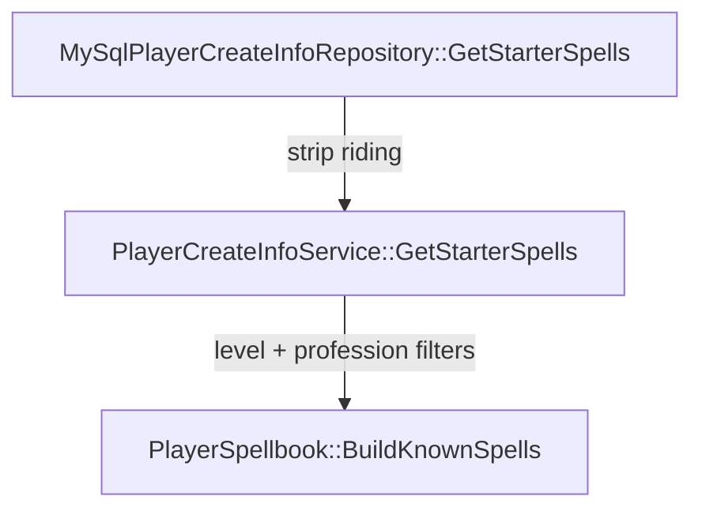

New characters receive their spawn location, known spells, and skill ranks from **`firelands_world`** tables modeled after Cataclysm 4.3.4 reference data. The world server reads this data through `IPlayerCreateInfoRepository` / `MySqlPlayerCreateInfoRepository` and `PlayerCreateInfoService` — there is no hardcoded per race/class spell list at runtime.

## Tables

| Table | Purpose |
|-------|---------|
| `playercreateinfo` | Spawn map, zone, and position per `(race, class)` |
| `playercreateinfo_spell` | Starter spellbook rows (`raceMask`, `classMask`, `spellId`) |
| `playercreateinfo_skill` | Starter skill lines and ranks |
| `playercreateinfo_item` | Extra create items merged after CharStartOutfit |
| `playercreateinfo_visual_items` | Optional outfit overrides (when not using DBC) |

### Mask columns

`playercreateinfo_spell` and `playercreateinfo_skill` use bitmask columns like quest `AllowableRaces` / `AllowableClasses`:

- **`raceMask = 0`** — all races
- **`classMask = 0`** — all classes
- Otherwise the row applies when `(raceMask & playerRaceMask) != 0` and `(classMask & playerClassMask) != 0`

Example: `(0, 1, 6603)` grants **Attack** to every warrior; `(2, 1, 20572)` grants **Blood Fury** to orc warriors only.

## What goes in `playercreateinfo_spell`

Rows come from two sources:

1. **Reference SQL** — `playercreateinfo_spell_custom` from `firelands-cata-ref` (class spell lists, filtered for riding and quest-gated warlock summons).
2. **Client DBC supplement** — weapon/armor/language passives, racial abilities, and learn-on-skill class-tab spells derived from `SkillLineAbility.dbc` + `SkillRaceClassInfo.dbc` (migration `62_world_playercreateinfo_dbc_spells.sql`).

At login, `PlayerSpellbook::BuildKnownSpells` loads spells from the repository, strips riding/transport IDs, and filters by character level using `Spell.dbc` definitions.

Racial-only rows (`raceMask != 0`) are also queried for cooldown handling (`GetRacialStarterSpells`).

## Regenerating data

From the **firelands-next** repo root (requires `firelands-cata-ref` and extracted client DBCs under `data/dbc/`):

```bash
# Spawn + ref class spells + starter skills
python3 tools/sql/import_ref_playercreateinfo.py

# DBC-derived weapon/armor/racial/learn-on-skill spells
python3 tools/sql/generate_playercreateinfo_dbc_spells.py
```

After editing migrations, refresh bundled schema for Docker:

```bash
cmake --build build --target merge-migrations
```

Restart the world server (or let the migrator apply pending files) so `playercreateinfo_*` changes take effect.

## Related migrations

| Migration | Role |
|-----------|------|
| `42`–`45` | Table DDL and ref spawn/spell/skill data |
| `46`–`51` | Starter fixes (riding removal, class openers, warlock summons) |
| `61` | Learn-on-skill class-tab spells (subset; superseded by `62` for full DBC set) |
| `62` | Full DBC-derived starter spell rows |

## Code path



Profession and guild perk spells are blocked via `IsSpellFromExcludedSkillLine` (`SkillLineAbility.dbc` index loaded at world startup), not via starter table rows.

See also: [Database](/wiki/docs/database/), [Architecture](/wiki/docs/architecture/).
