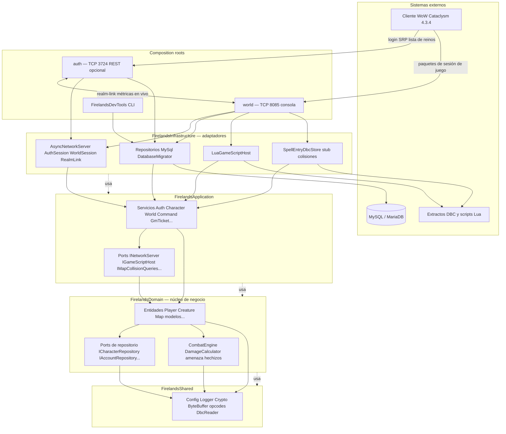

# Arquitectura Hexagonal

**firelands-next** implementa la **Arquitectura Hexagonal** (Ports & Adapters). Las reglas de negocio están en el centro; bases de datos, sockets, Lua y archivos DBC se conectan mediante interfaces. El cliente objetivo es **WoW Cataclysm 4.3.4 (build 15595)**.

## Definiciones Clave

| Término | Significado en Firelands |
|---------|-------------------------|
| **Port** | Interfaz abstracta de la que depende el núcleo (p. ej. `ICharacterRepository`, `IGameScriptHost`). Las capas domain y application definen ports; infrastructure los implementa. |
| **Adapter** | Implementación concreta de un port (p. ej. `MySqlCharacterRepository`, `LuaGameScriptHost`). Vive en `infrastructure/`. |
| **Entity** | Objeto mutable con identidad y ciclo de vida (p. ej. `Player`, `Creature`, `Character`). |
| **Value Object** | Dato inmutable sin identidad (p. ej. coordenadas, snapshots de cooldown, GUIDs). |
| **Use Case / Service** | Orquestación en application (p. ej. `CharacterService`, `CommandService`) que coordina el dominio vía ports. |
| **Composition Root** | Punto de entrada ejecutable (`auth`, `world`) que conecta adaptadores concretos a ports al arrancar. |
| **Repository** | Port de persistencia; domain declara `I*Repository`, infrastructure provee `MySql*`. |

## Estructura de Capas
```
src/
├── shared/           # FirelandsShared — config, logging, crypto, DBC, wire formats
├── domain/           # FirelandsDomain — entities, world model, combat, repository ports
├── application/      # FirelandsApplication — use cases, services, application ports
├── infrastructure/   # FirelandsInfrastructure — MySQL, ASIO, Lua, DBC stores, REST
├── auth/             # Auth server composition root
├── world/            # World server composition root
└── tools/            # FirelandsDevTools CLI
```

**Orden de enlace CMake:** `FirelandsShared` → `FirelandsDomain` → `FirelandsApplication` → `FirelandsInfrastructure` → ejecutables.

## Regla de Dependencias

- `domain/` **no** debe importar de `application/` ni `infrastructure/`.
- `application/` depende solo de `domain/` + `shared/` — sin headers concretos de MySQL o Boost.Asio.
- Las dependencias externas fluyen hacia adentro: **Infrastructure → Application → Domain → Shared**.
- La comunicación entre capas usa ports abstractos, inyectados al arrancar en `auth/main.cpp` y `world/main.cpp`.

## Capa Shared (`FirelandsShared`)

Biblioteca más baja; sin servicios de juego ni persistencia. Añade código aquí solo cuando varias capas lo necesiten y no dependa de MariaDB/ASIO.

| Área | Ruta | Propósito |
|------|------|-----------|
| Config | `shared/Config.{h,cpp}` | Carga YAML; overrides `FIRELANDS_AUTH_CONFIG` / `FIRELANDS_WORLD_CONFIG` |
| Logging | `shared/Logger.h` | Wrapper spdlog; incluir siempre vía este header |
| Crypto / SRP | `shared/Crypto.h`, `SRPConstants.h`, `BigInt.h` | Matemática SRP-6a para autenticación |
| Red | `shared/network/` | `ByteBuffer`, `WorldPacket`, opcodes, codecs wire, `WorldCrypt.h` |
| DBC | `shared/dbc/DbcReader.cpp` | Lector de tablas binarias estilo `.dbc` |
| Helpers de juego | `shared/game/` | Niveles de acceso, permisos, apariencia GM, tablas de experiencia |
| TUI | `shared/tui/` | Helpers FTXUI para consolas interactivas |

## Capa de Dominio (`FirelandsDomain`)

Modela **qué** manipula el emulador — no **cómo** se almacenan datos o se envían paquetes.

### Entidades de mundo (`domain/world/`)

| Tipo | Archivo | Rol |
|------|---------|-----|
| `WorldObject` | `WorldObject.h` | Base: GUID, posición `MovementInfo` |
| `Player` | `Player.{h,cpp}` | Salud/poder en vivo, auras, notificaciones de mapa |
| `Creature` | `Creature.{h,cpp}` | Entry NPC, facción, flags, XP de combate |
| `GameObject` | `GameObject.{h,cpp}` | Colocación de objetos de mundo |
| `Map` | `Map.{h,cpp}` | Cuadrícula / indexado espacial |
| `Aura` | `Aura.h`, `UnitAuraState.*` | Estado de buffs/debuffs |

### Modelos de cuenta/datos (`domain/models/`)

`Character`, `Realm`, `PlayerCreateInfo`, `GmTicket`, `GossipMenu`, `NpcText`, `QuestGossip`, `SpellDefinition`, `WebSession`, `Chat`, y `Account` (vía `IAccountRepository.h`).

### Dominio de combate (`domain/combat/`)

| Componente | Rol |
|------------|-----|
| `CombatEngine` | Resolución central de combate |
| `DamageCalculator` | Fórmulas de daño |
| `ICombatEntity` | Contrato de entidad en combate |
| `IThreatManager` | Port de tabla de amenaza |
| `ISpellProcessor` | Port de procesamiento de hechizos |

### Ports de repositorio (`domain/repositories/`)

| Port | Propósito |
|------|-----------|
| `IAccountRepository` | Cuentas, verificadores SRP, claves de sesión |
| `IRealmRepository` | Filas de lista de reinos |
| `ICharacterRepository` | CRUD de personajes y estado online |
| `IPlayerCreateInfoRepository` | Posiciones, hechizos y skills iniciales |
| `IWebSessionRepository` | Seguimiento de sesiones REST |
| `IGmTicketRepository` | Tickets de ayuda GM |
| `IGossipRepository` | Datos de menús gossip |
| `INpcTextRepository` | Texto de diálogo NPC |
| `IQuestGossipRepository` | Líneas gossip de misiones |
| `ICreatureSpawnRepository` | Filas de spawn de criaturas |
| `ICreatureClassLevelStatsRepository` | Stats de nivel NPC |
| `INpcTemplateSearchRepository` | Búsqueda `.npc search` |
| `ISpellDefinitionStore` | Metadatos de hechizos |
| `ISpellCastTables` | Tablas de cast / coste de poder |

## Capa de Aplicación (`FirelandsApplication`)

Casos de uso y orquestación sin conocer MariaDB ni detalles de sockets.

### Servicios (`application/services/`)

| Servicio | Rol |
|----------|-----|
| `AuthService` | Búsqueda de cuenta, verificación SRP, claves de sesión |
| `SRPService` | Helpers de verificación SRP-6a |
| `CharacterService` | Lista y persistencia de personajes |
| `PlayerCreateInfoService` | Plantillas de creación de personaje |
| `RealmListService` | Lista de reinos + población en vivo vía `IRealmLiveState` |
| `WorldService` | Fachada del mundo: mapas, jugadores, criaturas, host Lua, colisiones |
| `CommandService` | Comandos `.` de staff y consola |
| `GmTicketService` | Cola de tickets, asignación, respuestas |
| `OnlineCharacterSessionRegistry` | Nombre online → sesión para consola |
| `WebSessionService` | Flujos REST de login/sesión |

### Hechizos y combate (`application/spell/`, `application/combat/`)

`SpellManager` y módulos de efectos; `CombatService`, hostilidad, persecución.

### Ports de aplicación (`application/ports/`)

| Port | Implementado por |
|------|------------------|
| `INetworkServer` | `AsyncNetworkServer` |
| `IAuthSession` | `AuthSession` |
| `ICommandService` / `ICommandSession` | `CommandService` / `WorldSession` |
| `IGameScriptHost` | `LuaGameScriptHost` |
| `IMapCollisionQueries` | `MapCollisionQueriesStub` (vmap planificado) |
| `IMapNotifier` | Notificaciones de mapa/jugador |
| `IRealmLiveState` | `RealmLiveRegistry` + realm-link |

## Capa de Infraestructura (`FirelandsInfrastructure`)

Conecta el emulador con el mundo exterior. Todo I/O de sockets usa **corrutinas C++20** (`co_await`, `boost::asio::use_awaitable`).

### Persistencia (`infrastructure/persistence/`)

| Adaptador | Port |
|-----------|------|
| `DatabaseMigrator` | Ejecuta `sql/bundled/` → `sql/init/` → `sql/migrations/`; rastrea `schema_migrations` |
| `MySqlAccountRepository` | `IAccountRepository` |
| `MySqlRealmRepository` | `IRealmRepository` |
| `MySqlCharacterRepository` | `ICharacterRepository` |
| `MySqlPlayerCreateInfoRepository` | `IPlayerCreateInfoRepository` |
| `MySqlGmTicketRepository` | `IGmTicketRepository` |
| `MySqlGossipRepository`, `MySqlNpcTextRepository`, `MySqlQuestGossipRepository` | Ports gossip |
| `MySqlCreatureSpawnRepository`, `MySqlCreatureClassLevelStatsRepository` | Spawn/stats |
| `MemoryWebSessionRepository` | `IWebSessionRepository` (en memoria) |
| `InMemoryThreatManager`, `MySqlThreatManager`, `MySqlSpellProcessor` | Ports de combate |

### Red (`infrastructure/network/`)

| Componente | Rol |
|------------|-----|
| `AsyncNetworkServer` | Bucle accept con corrutinas; `Update()` hace poll de `io_context` |
| `AuthSession` | Bucles read/write del cliente auth |
| `WorldSession` | Cliente world; handlers en `worldsession/*.cpp` |
| `RestAuthServer` | Login REST en `Network.RestPort` |
| `RealmLinkSession` / `RealmLinkOutbound` | Métricas auth ↔ world en vivo |

### Otros adaptadores

| Componente | Rol |
|------------|-----|
| `LuaGameScriptHost` | Scripting Lua 5.4 bajo `Scripting.ScriptsDirectory` |
| `SpellEntryDbcStore`, `SpellCastTablesDbc` | Datos DBC de hechizos |
| `MapCollisionQueriesStub` | Placeholder hasta integración vmap completa |

## Ejecutables (Composition Roots)

| Objetivo | Binario | Resumen de arranque |
|----------|---------|---------------------|
| `auth` | `build/bin/auth` | Carga `authserver.yaml` → migra BD → conecta repos MySQL → TCP auth (3724), realm-link + REST opcional (8081) |
| `world` | `build/bin/world` | Carga `worldserver.yaml` → init Lua + `world_startup` → migra BD → conecta BD auth/characters/world → TCP world (8085) + consola |
| `FirelandsDevTools` | `build/bin/FirelandsDevTools` | CLI de cuentas y reinos |

**Flujo operativo:** los clientes se autentican en **auth** (SRP-6a, lista de reinos), luego conectan a **world** con cripto derivada de sesión. **Realm-link** sincroniza población/carga en vivo de world a auth si está configurado.

## Formato de Red

Paquetes y opcodes apuntan a **WoW Cataclysm 4.3.4 (build 15595)**. Builders compartidos en `src/shared/network/`. `ByteBuffer` usa helpers `std::span` de C++20. Los handlers de `WorldSession` se reparten por tema: movimiento, hechizos, gossip, estado GM, tickets, updates de objetos.

## Encabezados Precompilados (PCH)

Encabezados pesados precompilados: contenedores STL, spdlog, nlohmann/json, `shared/Common.h`, `shared/Logger.h`. Al añadir targets:

```cmake
target_precompile_headers(<target_name> PRIVATE ${PROJECT_PCH_HEADERS})
```

**Importante:** spdlog DEBE incluirse vía `<shared/Logger.h>`. `LuaGameScriptHost.cpp` omite PCH por compatibilidad del toolchain.

## Convenciones C++

| Regla | Detalle |
|-------|---------|
| Estándar | C++20 (`std::filesystem`, `std::optional`, `std::variant`, `std::span`, corrutinas en red) |
| Nombres | `snake_case` funciones/variables; `PascalCase` tipos; `UPPER_SNAKE_CASE` constantes; archivos en **kebab-case** |
| Idioma | Solo inglés en código, comentarios y commits |
| Términos WoW | Nomenclatura Blizzard: `Aura`, `Unit`, `SpellEffect`, etc. |
| Logging | Siempre vía `<shared/Logger.h>` |
| Hilos | `std::thread` en código de negocio |
| Commits | `type(scope): description` — tipos: `feat`, `fix`, `refactor`, `docs`, `test`, `chore`, `perf` |
| TDD | Rojo → Verde → Refactor para comportamiento nuevo |

## Diagrama arquitectónico

Vista general de los **composition roots**, las **capas** hexagonales y los **sistemas externos**. Las flechas sólidas muestran cableado en tiempo de ejecución; las líneas punteadas muestran la **regla de dependencias** (cada capa solo depende de las inferiores — domain nunca importa infrastructure).



**Orden de enlace CMake (bibliotecas):** `FirelandsShared` → `FirelandsDomain` → `FirelandsApplication` → `FirelandsInfrastructure` → `auth` / `world` / `FirelandsDevTools`.
