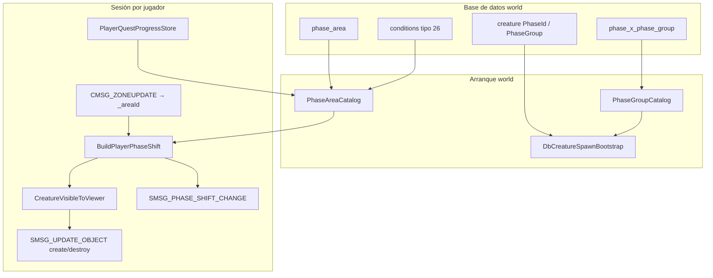

# Sistema de Fases

El **phasing** de Cataclysm permite que distintos jugadores vean estados distintos del mundo en las mismas coordenadas: hubs que cambian tras misiones, zonas iniciales como Gilneas, triggers de script y NPCs que aparecen o desaparecen según el **PhaseId**.

Firelands implementa el modelo **PhaseId** de Cataclysm (no el antiguo `phaseMask` en spawns). La visibilidad se calcula en el servidor con `PhaseShift` en jugador y criatura, se sincroniza con `SMSG_PHASE_SHIFT_CHANGE` y se filtra el tráfico `SMSG_UPDATE_OBJECT`.

## Resumen

| Tema | Ubicación |
|------|-----------|
| Matemática de visibilidad | `src/shared/game/PhaseShift.{h,cpp}` |
| Fase del jugador | `src/application/world/PlayerPhaseShift.{h,cpp}` |
| Área + misiones | `PhaseAreaCatalog`, `PhaseConditionEvaluator` |
| Grupos de fase | `PhaseGroupCatalog` |
| Carga world DB | `MySqlPhase*Repository`, migraciones `53`–`57`, `59` |
| Progreso de misiones | `character_queststatus*` (migración `58`) |
| Sesión | `WorldSessionPhasing.cpp`, `WorldSessionAreaPhasing.cpp` |
| Paquete cliente | `PhaseShiftWire` → `SMSG_PHASE_SHIFT_CHANGE` |
| Spawns | `DbCreatureSpawnBootstrap` + `InitDbCreaturePhaseShift` |



## Concepto central: `PhaseShift`

Cada jugador y criatura tiene un `PhaseShift` (`src/shared/game/PhaseShift.h`):

| Campo | Rol |
|-------|-----|
| `flags` | `Unphased`, `Inverse`, `AlwaysVisible`, etc. |
| `phases` | Lista de IDs de fase (uint16) |
| `personalGuid` | Fases personales (poco usado aún) |

**Fase por defecto** `169` (`kDefaultPhaseId`): mundo normal. Spawns sin fase explícita o solo con la default se tratan como **unphased** y son visibles para jugadores unphased.

`PhaseShift::CanSee(other)` aplica estas reglas:

1. Ambos **unphased** → visibles.
2. Cualquiera con **AlwaysVisible** → visibles.
3. Ambos **inverse** → visibles.
4. Si ninguno es inverse: visible si **hay intersección de phase IDs**.
5. Con **inverse**: visible si las fases del visor **no** coinciden con las del sujeto.

Tests: `tests/unit/shared/PhaseShiftTests.cpp`.

## Capa de base de datos

### Tablas world (`firelands_world`)

#### `phase_area`

| Columna | Descripción |
|---------|-------------|
| `AreaId` | Área de `AreaTable.dbc` (PK) |
| `PhaseId` | Fase a aplicar (PK) |
| `Comment` | Nota |

Varias filas por área = fases distintas según condiciones (ej. Highbank `169` vs `361` según misión `28598`).

Migración `54` (DDL), `55` (datos).

#### `phase_x_phase_group`

Expande un **PhaseGroup** en varios `PhaseID` (como `PhaseXPhaseGroup.dbc`).

Usado cuando `creature.PhaseId = 0` y `PhaseGroup != 0`. Migraciones `53` + `55`.

#### `conditions` (tipo 26)

Puertas de misión/aura para un par `(PhaseId, AreaId)`.

| Tipo en BD | Significado |
|---------|-------------|
| `1` | Aura activa (`Value1` = spell) |
| `8` | Misión entregada |
| `9` | Misión tomada (incompleta) |
| `28` | Misión completa sin recompensa |

`ElseGroup`: OR entre grupos; AND dentro del grupo. Migraciones `56` + `57`.

#### `creature`

| Columna | Descripción |
|---------|-------------|
| `phaseUseFlags` | `0x1` siempre visible; `0x2` inverse |
| `PhaseId` | Fase única |
| `PhaseGroup` | Resuelto vía `phase_x_phase_group` |

Triggers (`CREATURE_FLAG_EXTRA_TRIGGER`): display invisible para jugadores; GMs ven el modelo real (`GmCreatureVisibility.h`). Migración `59` corrige imports corruptos de triggers.

### Tablas characters

| Tabla | Uso |
|-------|-----|
| `character_queststatus` | Misiones activas |
| `character_queststatus_rewarded` | Misiones entregadas |

Migración `58`. Carga en login → `PlayerQuestProgressStore`.

### Herramientas de importación

```bash
python3 tools/sql/import_ref_phase_data.py
python3 tools/sql/import_ref_phase_conditions.py
```

Tras cambios: `merge-migrations` y reiniciar **world**.

## Implementación por capas

### Shared

- `PhaseShift` — reglas y `InitDbCreaturePhaseShift`
- `PhaseShiftWire` — `SMSG_PHASE_SHIFT_CHANGE`
- Auras: `kSpellAuraPhase` (261), `PhaseGroup` (326), `PhaseAlwaysVisible` (327)
- `AreaTableDbc::ResolveAreaForPhasing` — área válida para `phase_area` en el mapa actual

### Domain

Modelos `PhaseCondition`, ports `IPlayerQuestProgress`, repositorios `IPhase*`, `PhaseShift` en `Player` y `Creature`.

### Application

- `PhaseGroupCatalog`, `PhaseAreaCatalog` (sube padres en `AreaTable` hasta 32 niveles)
- `PhaseConditionEvaluator` — semántica ElseGroup
- `BuildPlayerPhaseShift`: fases de área → auras de hechizo → `FinalizePlayerUnphasedFlag`

### Infrastructure

Repositorios MySQL, arranque en `WorldApplication.cpp`, sesión en `WorldSessionPhasing.cpp`:

| Evento | Acción |
|--------|--------|
| Login | Cargar misiones, reconstruir fase, paquete al cliente, spawns visibles |
| `CMSG_ZONEUPDATE` | Cambio de `_areaId` → rebuild + refresco cercano |
| Aura de fase | `MaybeRefreshPlayerPhaseAfterAuraChange` |
| Progreso de misión | `RefreshPlayerPhaseVisibilityFromQuestProgress()` (misma ruta) |

## Protocolo cliente

`SMSG_PHASE_SHIFT_CHANGE`: GUID, flags, lista de fases (flags + id), personalGuid, tres uint32 reservados.

## Comportamiento en juego

- **Login**: solo criaturas visibles según `CanSee`.
- **Cambio de zona**: recalcula `phase_area` + condiciones.
- **Auras**: hechizos con aura de fase actualizan sin cambiar de área.
- **Spawns**: `PhaseShift` fijo al cargar; grupos añaden varios IDs (visible si el jugador comparte **alguno**).
- **GM tag**: ve todo; triggers seleccionables; al apagar `.gm` se resincroniza visibilidad.

## Scripting (Lua)

**Sin API Lua dedicada** por ahora. Patrones actuales:

| Objetivo | Enfoque |
|----------|---------|
| Fase temporal | Hechizo con aura `SPELL_AURA_PHASE` / `PHASE_GROUP` |
| Fase por zona/historia | Filas `phase_area` + `conditions` |
| Ocultar spawn | `PhaseId` / `PhaseGroup` en `creature` |
| Trigger por jugador | Patrón `PhaseId=1`, `PhaseGroup=169` en triggers |

Futuro: refresco en vivo al completar misión, instancias, helpers Lua. Ver [Roadmap](/wiki/es/docs/roadmap/).

## Limitación: misiones en vivo

`RefreshPlayerPhaseVisibilityFromQuestProgress()` existe, pero los manejadores de misión **aún no lo invocan**. Las puertas por misión aplican bien **tras relog** si el progreso está en DB, no necesariamente al entregar en la misma sesión.

## Pruebas

```bash
ctest --test-dir build -R 'Phase|GmCreature'
```

Archivos: `PhaseShiftTests`, `PlayerPhaseShiftTests`, `PhaseConditionEvaluatorTests`, `PhaseAreaCatalogTests`, `GmCreatureVisibilityTests`.

## Documentación relacionada

- [Arquitectura](/wiki/es/docs/architecture/)
- [Base de datos](/wiki/es/docs/database/)
- [Comandos GM](/wiki/es/docs/gm-commands/)
- [Roadmap](/wiki/es/docs/roadmap/)
